# Orienta

## Project Overview
Orienta is a platform designed to **facilitate job and training search** for people seeking new professional opportunities.  
The platform also enables structured management and sharing of candidate profiles, optimized for recruiters.

The solution is composed of several core features:  
1. **CV Creation**  
2. **Job Search**  
3. **Training Search**  
4. **Candidate List**

---

## Features

### 1. CV Creation
- Easily create your CV using predefined templates.  
- Edit your CV directly on the platform.  
- Download the CV in PDF format.  
- **Automatic saving**: your CV is saved automatically, even if you leave the site before finishing.

### 2. Job Search
- Import your CV using simple **drag & drop**.  
- AI analyzes your profile and automatically generates optimized queries to find jobs matching your skills.  
- Results are retrieved via the Google Custom Search API.

### 3. Training Search
- Analysis of missing skills for a target position.  
- AI suggests relevant training programs to fill these gaps.  
- Training programs are automatically searched using optimized queries.

### 4. Recruiter 
- Access to a **marketplace** of candidate profiles.  
- Each profile is standardized and can be viewed by recruiters.  
- Candidate CVs are available for consultation.

---

## Architecture and Data Flow

### CV Creation
1. CV editing through the frontend interface  
2. Download in PDF format  
3. Publication to the marketplace → Backend → Database  

### Job Search
1. CV import  
2. CV analysis using **Gemini**  
3. Generation of an optimized Google query via **GPT-4o-mini**  
4. Job search through **Google Custom Search API**  
5. Retrieval of matching job listings  

```mermaid
graph LR
    %% Define styles
    classDef userNode fill:#0073b1,stroke:#fff,color:#fff,stroke-width:2px;
    classDef serverNode fill:#f5f5f5,stroke:#333,stroke-width:1.5px;
    classDef iaNode fill:#e8f4f8,stroke:#0073b1,stroke-width:1.5px;
    classDef apiNode fill:#f0f0f0,stroke:#34a853,stroke-width:1.5px;
    classDef resultNode fill:#fff,stroke:#0073b1,stroke-width:2px;
    
    %% Workflow elements
    A[👤 User] -->|Import/Drag & Drop CV| B[🌐 Frontend];
    B -->|Send CV| C[⚙️ Backend];
    C -->|Analyze| D[🤖 AI Model];
    D -->|1. Extract: experiences, target job| D;
    D -->|2. Optimized Google query| C;
    C -->|Search query| E[🔗 API<br/>Google Custom Search];
    E -->|JSON/XML Results| C;
    C -->|Job offers| B;
    B -->|📄 Display results| F[📋 Results];
    
    %% Apply styles
    class A userNode;
    class B,C serverNode;
    class D iaNode;
    class E apiNode;
    class F resultNode;
    
    %% Diagram style
    linkStyle default stroke:#0073b1,stroke-width:2px;
```




### Training Search
1. CV import  
2. Analysis of missing skills for the target position using **Gemini** and GPT  
3. Generation of Google queries to find training programs matching missing skills  
4. Search via **Google Custom Search API**  

```mermaid
graph TD 
    %% Define styles with lighter grays but white text
    classDef userNode fill:#0073b1,stroke:#fff,color:#fff,stroke-width:2px;
    classDef frontendNode fill:#555555,stroke:#fff,color:#fff,stroke-width:1.5px;
    classDef backendNode fill:#666666,stroke:#fff,color:#fff,stroke-width:1.5px;
    classDef iaNode fill:#444444,stroke:#fff,color:#fff,stroke-width:1.5px;
    classDef apiNode fill:#4A4A4A,stroke:#fff,color:#fff,stroke-width:1.5px;
    classDef resultNode fill:#333333,stroke:#fff,color:#fff,stroke-width:2px;
    
    %% Main workflow
    A[👤 User] -->|1. Import CV| B[📱 Frontend];
    
    subgraph "User Interface"
        B -->|2. Send CV + Target Job| C[⚙️ Backend];
    end
    
    subgraph "Analysis & Comparison"
        C -->|3. CV Analysis| D[🤖 AI: Analyzer];
        D -->|4. Skill Extraction| D;
        D -->|5. Target Job Identification| E[🎯 Comparator];
        E -->|6. Required vs Current Skills| E;
        E -->|7. Gap Detection| F[📊 Query Generator];
    end
    
    subgraph "Training Search"
        F -->|8. Queries per Skill| G[🔍 Training API<br/>Google Custom Search];
        G -->|9. Raw Results| H[📦 Aggregator];
        H -->|10. Filtering & Ranking| H;
    end
    
    H -->|11. Recommended Trainings| C;
    C -->|12. Display Results| I[📚 Personalized Trainings];
    I -->|13. Consultation| A;
    
    %% Apply styles
    class A userNode;
    class B frontendNode;
    class C,H backendNode;
    class D,E,F iaNode;
    class G apiNode;
    class I resultNode;
    
    %% Global style for background
    style TD fill:#2D2D2D,color:#fff;
    
    %% Arrow styles
    linkStyle 0 stroke:#64B5F6,stroke-width:2px;
    linkStyle 1 stroke:#64B5F6,stroke-width:2px;
    linkStyle 2,3,4,5,6 stroke:#64B5F6,stroke-width:2px;
    linkStyle 7 stroke:#81C784,stroke-width:2px;
    linkStyle 8,9 stroke:#81C784,stroke-width:2px;
    linkStyle 10,11 stroke:#64B5F6,stroke-width:2px;
    linkStyle 12 stroke:#64B5F6,stroke-width:2px;
```



### Candidate List
- Profiles are retrieved from the CV model stored in the database.

---

## AI Models and Tools Used
- **Gemini 2.5 Flash**: CV data extraction  
- **GPT-4o-mini**: generation of optimized Google search queries  
- **Google Custom Search API**: retrieval of job and training results  

---

## Requirements and Installation

### Requirements
- Docker (if using Docker Compose)  
- Postgres 16.10  
- Java 17  
- Apache Maven 3.9.9  
- Node.js 24.8.0  
- npm  
 
### application.properties Configuration (read tools installation.md)
Once the API keys are created, add them to the backend configuration file:

`backend/src/main/resources/application.properties`

```properties
# API Keys for AI and Search
openai.api.key=YOUR_OPENAI_API_KEY
google.gemini.api.key=YOUR_GEMINI_API_KEY
google.api.key=YOUR_GOOGLE_API_KEY
google.search.engine.id=YOUR_SEARCH_ENGINE_ID

#### If using Docker 
docker compose up -d

#### Else 
Backend 
cd backend
mvn install
mvn spring-boot:run

Frontend 
cd cv-frontend
npm install
npm run dev